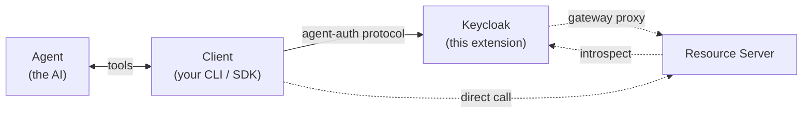
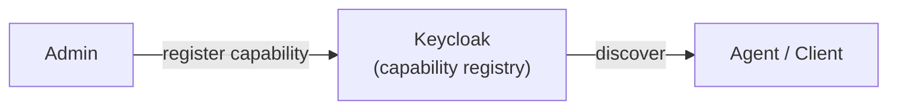

# Keycloak Agent Auth Protocol Extension

A Keycloak extension implementing the [Agent Auth Protocol](https://agent-auth-protocol.com/) (v1.0-draft), which establishes AI agents as first-class principals with their own identity, scoped capabilities, and independent lifecycle.

## Why Keycloak?

Keycloak is a natural fit for Agent Auth because it already manages users, sessions, tokens, approvals, and audit logging. This extension adds agent-specific concepts (hosts, agents, capability grants) while reusing Keycloak's existing infrastructure for user identity, user-driven approval, and audit events. Device-authorization approval (AAP §7.1) and CIBA push (AAP §7.2 — email-based, with the in-realm `/inbox` poll as a fallback) are both implemented on top of Keycloak user sessions. The extension also integrates with Keycloak Organizations for multi-tenant capability registries — capabilities can be scoped to an org and/or gated on a realm role, with eager cascade revocation when a user leaves an org.

## Architecture

**Hybrid model** -- Keycloak handles the auth plane; resource servers handle capability execution.



The **Client** is the process that holds the host keypair, signs JWTs, and speaks the agent-auth protocol — your CLI, SDK, or background worker (e.g. the Claude Code CLI binary). The **Agent** is the AI reasoning loop that runs inside the Client and requests capabilities through tool calls (MCP, SDK functions); it never talks to Keycloak directly.

Solid edges always happen; dashed edges are mode-specific (gateway vs direct execution). Host-scoped calls (register / status / revoke / rotate) carry a `host+jwt`; agent-scoped calls (execute / introspect) carry an `agent+jwt`. Exact URLs and auth details are in the endpoint tables below; end-to-end temporal sequence is in [docs/architecture.md](docs/architecture.md).

### What lives in Keycloak (this extension)

| Concern | Endpoint | Description |
|---------|----------|-------------|
| Discovery | `GET /.well-known/agent-configuration` | Protocol discovery (WellKnownProvider SPI) |
| Health | `GET /agent-auth/health` | Liveness probe; confirms the extension is loaded |
| Registration | `POST /agent/register` | Register agent under a host |
| Status | `GET /agent/status` | Check agent status + grants |
| Grant status | `GET /agent/{agentId}/capabilities/{capabilityName}/status` | Poll a pending grant while it awaits approval |
| Revocation | `POST /agent/revoke` | Permanently revoke an agent |
| Reactivation | `POST /agent/reactivate` | Reactivate an expired agent |
| Introspect | `POST /agent/introspect` | Validate agent JWT (RFC 7662 model) |
| Key rotation | `POST /agent/rotate-key` | Replace agent's public key |
| Host revocation | `POST /host/revoke` | Revoke host + cascade to all agents |
| Host key rotation | `POST /host/rotate-key` | Replace host's public key |
| Capability request | `POST /agent/request-capability` | Request additional capabilities |
| Capability listing | `GET /capability/list` | List available capabilities |
| Capability detail | `GET /capability/describe` | Get full capability schema |
| Capability execution (gateway) | `POST /capability/execute` | Keycloak introspects the agent JWT, runs constraint checks, and proxies to `<capability.location>` |
| Device-auth approve | `POST /verify/approve` | Authenticated realm user approves a pending agent via their `user_code` (AAP §7.1). Activates the agent and links the host to the approving user. Layer-2 gate: grants whose cap fails the user's org/role entitlement flip to `denied(insufficient_authority)` while passing grants go `active`. |
| Device-auth deny | `POST /verify/deny` | Authenticated realm user denies a pending agent; terminal (subsequent approve attempts return 410). |
| CIBA inbox | `GET /agent-auth/inbox` | Authenticated realm user lists pending approvals routed to them via CIBA (§7.2). Used as the in-realm fallback when SMTP isn't available. |
| **Admin:** capability CRUD (realm-wide) | `POST / PUT / DELETE /admin/.../agent-auth/capabilities[/{name}]` | Register, update, and delete capabilities. Realm-admin only. |
| **Admin:** capability CRUD (org-scoped) | `POST / GET / PUT / DELETE /admin/.../agent-auth/organizations/{orgId}/capabilities[/{name}]` | Mintable by `manage-organization`-role holders who are members of the target org. `organization_id` is derived from the path; the body can't override it. Cross-org PUT/DELETE returns 404. |
| **Admin:** approve grant | `POST /admin/.../agent-auth/agents/{id}/capabilities/{capability}/approve` | Approve a pending capability grant |
| **Admin:** reject / expire agent | `POST /admin/.../agent-auth/agents/{id}/{reject\|expire}` | Reject a pending agent or force-expire an active one |
| **Admin:** agent grants | `GET /admin/.../agent-auth/agents/{id}/grants` | Returns the rows from the `AGENT_AUTH_AGENT_GRANT` secondary index — useful for verifying the index stays in sync with the per-agent grant list. |
| **Admin:** pre-register host | `POST /admin/.../agent-auth/hosts` | Pre-create a host record with an inline Ed25519 JWK (spec §2.8 "Pre-registration" flow). Optional `client_id` field resolves the confidential client's service-account user and stores it as the host's `user_id`, so autonomous workloads can skip the post-claim approval flow. |
| **Admin:** fetch host | `GET /admin/.../agent-auth/hosts/{id}` | Fetch a host record by thumbprint |
| **Admin:** link host to user | `POST /admin/.../agent-auth/hosts/{id}/link` | Bind a host to a Keycloak user (§2.9). Cascades: autonomous agents → `claimed` with grants revoked (§2.10); delegated agents inherit `user_id` (§3.2) |
| **Admin:** unlink host | `DELETE /admin/.../agent-auth/hosts/{id}/link` | Remove the host→user binding. Revokes all delegated agents under the host (§2.9); autonomous agents stay `claimed` (terminal) |

### What lives in the resource server

| Concern | Description |
|---------|-------------|
| Capability execution | Receives capability requests, runs business logic |
| JWT validation | Calls Keycloak's `/agent/introspect` to verify agent JWTs, or verifies signature/audience locally when it has the agent key material |

The resource server can be written in **any language**. For each request it should verify that the JWT `aud` matches its own capability URL, call Keycloak's `/agent/introspect` with `{"token":"..."}` (or `{"token":"...","capability":"...","arguments":{...}}` when it wants Keycloak to run constraint checks), and reject the request when `active` is `false` or when `violations` is present and non-empty.

### Execution modes

Both execution paths defined by the spec are supported; the agent picks which one to call:

- **Gateway** — agent `POST`s to Keycloak's `/capability/execute` with `{capability, arguments}`. Keycloak introspects the agent JWT, runs constraint checks, and proxies the request to `<capability.location>`. The resource server does not need to call `/agent/introspect` itself. Synchronous, async-pending, and SSE streaming responses are all proxied.
- **Direct** — agent `POST`s straight to `<capability.location>` with its agent JWT in the `Authorization` header. The resource server calls `/agent/introspect` to validate and reject accordingly. Useful when the resource server wants finer-grained control, already runs its own auth plumbing, or prefers to avoid an extra hop.

### Protocol actors and roles

Five actors show up in the spec; this extension only implements one of them (Server). The others are what you plug in around Keycloak.

| Actor | Role | Implementation note |
|-------|------|---------------------|
| **Agent** (§2.1) | Runtime AI actor scoped to a conversation/task. Doesn't hold keys itself. | Yours — any LLM/runtime. Out of scope for this repo. |
| **Client** (§1.5) | Process that holds the host keypair, exposes protocol tools (MCP/CLI/SDK) to agents, signs host/agent JWTs, and speaks HTTP to the server. | Yours — any language. One "client install" ≡ one host identity. |
| **Host** (§2.7) | Persistent identity of the client environment (Ed25519 keypair + metadata). Not an actor — a principal the client holds. | Stored in this extension's `AGENT_AUTH_HOST` table. |
| **Server** (§1.5) | Authorization server: discovery, registration, approvals, grants, introspection, gateway execution. | **This extension + Keycloak core.** |
| **Resource Server** (§2.15) | Host of the capability's business logic, addressed by `capability.location`. Validates agent JWTs either locally or via `/agent/introspect`. | Yours — any language. Use gateway mode if you don't want to implement introspection. |
| **User** (implicit) | Human who approves delegated flows. | A Keycloak realm user. Hosts are bound to users either by the admin API (`/admin/.../hosts/{id}/link`, §2.9, §2.10) or implicitly on device-authorization approval: the user authenticates to Keycloak and POSTs their `user_code` to `/verify/approve`, which activates the agent and links the host (AAP §7.1). CIBA is still planned. |

For the full protocol architecture diagram, end-to-end sequence walkthrough, extension internals, and per-concept mapping to source files, see [docs/architecture.md](docs/architecture.md).

## Centralized Capability Registry

Capabilities are registered in Keycloak by administrators via the admin API. This makes Keycloak the single source of truth for what capabilities exist and who has access to them.



Each capability has:
- **name** -- stable identifier (e.g. `check_balance`, `transfer_money`)
- **description** -- human-readable explanation
- **location** (optional) -- URL where the resource server executes the capability. If omitted, clients fall back to the server's `default_location` from discovery (per Agent Auth Protocol v1.0-draft §2.12 and §5.1). Capabilities without `location` are accepted for discovery and grants, but this extension cannot proxy them to a backing resource server until operators set an explicit resource-server URL.
- **input/output** -- JSON Schema for arguments and results
- **visibility** -- who can see it (public, authenticated)
- **requires_approval** -- whether user approval is needed before granting
- **organization_id** (optional) -- Keycloak organization id (multi-tenant scope). When set, only authenticated callers who are members of that org see / can be granted the cap. NULL = realm-wide (visible to any authenticated user). Only realm-admin can mint NULL-org caps; org-admins set this implicitly via the `/organizations/{orgId}/capabilities` endpoints.
- **required_role** (optional) -- realm role name (intra-tenant gate). When set, only callers holding that role can be granted. NULL = no role gate.

### Multi-tenant capability registries

Capabilities can be scoped to a Keycloak organization via `organization_id` (tenant boundary) and/or gated on a realm role via `required_role` (intra-tenant authorization). The two compose as `(cap.org_id IS NULL OR cap.org_id ∈ user.orgs) AND (cap.required_role IS NULL OR cap.required_role ∈ user.roles)`. Public-visibility caps bypass the gate (anonymous has no identity to match against).

Enforcement runs at three points: discovery (`/capability/list` and `/capability/describe`), approval (`/verify/approve` flips gate-failed grants to `denied(insufficient_authority)`), and runtime introspection (`/agent/introspect` strips dead grants from its response, the lazy half of the cascade). On `OrganizationMemberLeaveEvent` the extension eagerly revokes a leaving user's grants whose cap belonged to that org, with `reason=org_membership_removed`.

The Keycloak Organizations feature is required for org-scoped caps to work end-to-end. Without it, caps with `organization_id IS NULL` continue to work as before; caps with a set `organization_id` become invisible (fail-safe — no leakage when the feature isn't enabled).

### Capability Constraints

Grants can carry constraints that restrict what arguments an agent can supply:

```json
{
  "capability": "transfer_money",
  "status": "active",
  "constraints": {
    "amount": { "min": 0, "max": 1000 },
    "currency": { "in": ["USD", "EUR"] },
    "destination_account": "acc_456"
  }
}
```

Supported constraint operators: `max`, `min`, `in`, `not_in`, and exact value matching.

### Host and Agent Identity

Hosts and agents use Ed25519 key pairs. Registration can provide keys inline as public JWKs (`host_public_key`, `agent_public_key`) or by reference with JWKS URLs (`host_jwks_url`, `agent_jwks_url`). Inline keys and JWKS URLs are mutually exclusive for the same identity, and `agent_kid` is required when `agent_jwks_url` is used.

JWKS-based identities are cached in-process for 5 minutes. If a JWT arrives with a `kid` missing from cache, Keycloak refetches the JWKS once and retries, with per-URL kid-miss refetches rate-limited to one every 10 seconds. Inline-key hosts and agents rotate through the explicit key rotation endpoints; JWKS-based identities rotate by publishing the new key at their JWKS URL.

JWKS fetches require HTTPS, except for localhost and container-test hostnames used by local development and integration tests. That is intentionally stricter than the Agent Auth Protocol's URL-fetching guidance.

This extension does not sign protocol responses today, so discovery does not publish a server `jwks_uri` and `/agent-auth/jwks` is not exposed. Host and agent JWKS support is separate from server response signing.

## Key Design Decisions

| Decision | Choice | Rationale |
|----------|--------|-----------|
| Architecture | Hybrid (KC auth + external execution) | Avoids building a parallel auth system inside KC; lets KC do what it's good at |
| Discovery | `/realms/{realm}/.well-known/agent-configuration` via WellKnownProvider SPI | Follows KC's own OpenID discovery pattern |
| Crypto | Nimbus JOSE+JWT for Ed25519 | Already on KC classpath, high-level API, well-audited |
| Storage | JPA entities + Liquibase changelog via `JpaEntityProvider` SPI; fully typed columns on all four agent-auth tables; writes land in Keycloak's main persistence unit (H2 in dev, any KC-supported RDBMS in prod) | Survives Keycloak restarts and scales across replicas. Indexed `ORGANIZATION_ID` and `REQUIRED_ROLE` on capability make multi-tenant filter + cascade SQL-efficient. The `AGENT_AUTH_AGENT_GRANT` join table is a sync-on-write secondary index over per-agent grants. Selected by default via the `AgentAuthStorage` SPI (`kc.spi.agent-auth-storage.provider=in-memory` switches back to the process-local map for tests). |
| Scoping | Global env toggle + per-realm attribute override (planned) | Start simple, add granularity later |
| Approval flows | Device-authorization (AAP §7.1) and CIBA push (AAP §7.2 — email + in-realm `/inbox` fallback) over Keycloak user sessions, plus admin-mediated HTTP approval | Device-flow reuses KC's realm user auth to back the `user_code` approval step; CIBA emails the linked user with a deep link to `/verify/approve`; admin path stays for headless setups |
| Capabilities | Centralized in KC, optionally org-scoped | Single source of truth; resource servers just execute. Multi-tenancy via Keycloak Organizations + realm roles. |

## Protocol Reference

This extension implements [Agent Auth Protocol v1.0-draft](https://agent-auth-protocol.com/specification).

Key protocol concepts:
- **Host** -- persistent identity of the client environment where agents run (Ed25519 keypair)
- **Agent** -- per-agent identity with scoped capabilities and independent lifecycle
- **host+jwt / agent+jwt** -- short-lived Ed25519-signed JWTs (EdDSA, RFC 8037)
- **Delegated mode** -- agent acts on behalf of a user who approves requests
- **Autonomous mode** -- agent operates without user in the loop
- **Agent states** -- pending, active, expired, revoked, rejected, claimed

## Development

### Prerequisites

- Java 21+
- Maven 3.9+
- Docker (for integration tests)

### Build

```bash
mvn package -Pquick          # compile + package, skip tests
mvn test                      # unit tests only
mvn verify                    # unit + integration tests (starts Keycloak in Docker)
```

### Commit Messages

This repository uses Conventional Commits.

```bash
./scripts/install-hooks.sh
```

The hook rejects commit subjects that do not match formats like `feat: ...` or `fix(scope): ...`.

Release automation is handled by release-please.

Release asset uploads are verified in GitHub Actions.

### Local development with Docker Compose

```bash
docker compose up
```

Keycloak will be available at `http://localhost:28080` with the extension loaded. The agent-auth endpoints are at `/realms/{realm}/agent-auth/...`.

The Dockerfile is multi-stage — the builder runs `mvn package` against the checked-in source, then the runtime stage copies the extension JAR plus its runtime libs (nimbus-jose-jwt, tink) from `target/provider-libs/` into `/opt/keycloak/providers/`. No host JDK or Maven is required. The integration tests use the same `target/provider-libs/` directory via testcontainers, so the image and test harness share one source of truth for runtime deps.

### Project structure

```
src/main/java/.../agentauth/
  AgentAuthRealmResourceProvider.java        # JAX-RS resource (all protocol endpoints)
  AgentAuthRealmResourceProviderFactory.java # Keycloak RealmResourceProvider SPI factory
  AgentAuthAdminResourceProvider.java        # Admin REST resource (capability CRUD, agent expiry)
  AgentAuthAdminResourceProviderFactory.java # Keycloak AdminRealmResourceProvider SPI factory
  AgentAuthWellKnownProvider.java            # /.well-known/agent-configuration document
  AgentAuthWellKnownProviderFactory.java     # Keycloak WellKnownProvider SPI factory
  ConstraintValidator.java                   # Capability constraint enforcement
  ConstraintViolation.java                   # Violation record
  JwksCache.java                             # JWKS URL cache + kid-miss refetch handling
  storage/
    AgentAuthStorage.java                    # Storage SPI (provider interface)
    AgentAuthStorageProviderFactory.java     # Provider factory SPI
    AgentAuthStorageSpi.java                 # SPI registration
    InMemoryStorage.java                     # Process-local map impl (test fallback)
    InMemoryStorageFactory.java              # Factory for the in-memory impl
    jpa/
      AgentAuthJpaEntityProvider.java        # Registers entities + changelog with KC
      AgentAuthJpaEntityProviderFactory.java # JpaEntityProvider factory
      HostEntity.java                        # AGENT_AUTH_HOST row (typed columns)
      AgentEntity.java                       # AGENT_AUTH_AGENT row (typed columns)
      AgentGrantEntity.java                  # AGENT_AUTH_AGENT_GRANT row (composite PK secondary index)
      CapabilityEntity.java                  # AGENT_AUTH_CAPABILITY row (typed columns; ORG_ID + ROLE indexed)
      RotatedHostEntity.java                 # AGENT_AUTH_ROTATED_HOST row
      JpaStorage.java                        # AgentAuthStorage backed by EntityManager
      JpaStorageFactory.java                 # Default AgentAuthStorage factory (order=100)

src/main/resources/META-INF/
  agent-auth-changelog.xml                   # Liquibase changelog for AGENT_AUTH_* tables
  services/                                  # KC provider SPI descriptors

src/test/java/.../agentauth/
  support/
    BaseKeycloakIT.java                      # Shared Testcontainers Keycloak singleton (H2)
    BasePostgresE2E.java                     # Postgres-backed KC for E2Es
    PostgresSupport.java                     # Postgres container + KC wiring
    TestKeys.java                            # Ed25519 key generation helpers
    TestJwts.java                            # host+jwt / agent+jwt builders
    TestcontainersSupport.java               # Testcontainers configuration
  AgentAuthDiscoveryIT.java                  # §5.1  Discovery
  AgentAuthCapabilityCatalogIT.java          # §5.2  List/Describe capabilities
  AgentAuthRegistrationIT.java               # §5.3  Agent registration
  AgentAuthCapabilityRequestIT.java          # §5.4  Request capability
  AgentAuthLifecycleIT.java                  # §5.5–§5.10 Status, revoke, reactivate, key rotation
  AgentAuthCapabilityExecuteIT.java          # §5.11 Execute capability
  AgentAuthIntrospectIT.java                 # §5.12 Token introspection
  AgentAuthErrorResponseIT.java              # §5.13–§5.14 Error format + WWW-Authenticate
  AgentAuthAdminCapabilityRegistrationIT.java# Admin capability CRUD (realm-wide)
  AgentAuthOrgAdminCapabilityIT.java         # Phase 5: org-scoped admin endpoints + SA-as-host
  AgentAuthCatalogNoPublicCapsIT.java        # §5.2 "no public caps → 401" branch (isolated realm)
  AgentAuthMultiTenantCapabilityIT.java      # Phase 1: org/role gate on /capability/list + /describe
  AgentAuthMultiTenantApprovalIT.java        # Phase 2: approval-time + introspect-time enforcement
  AgentAuthOrgMembershipCascadeIT.java       # Phase 4: eager cascade on KC org-membership leave
  AgentAuthCapabilityWithoutOrgsIT.java      # Phase 1 robustness: realm-level orgs disabled
  AgentAuthGrantTableSyncIT.java             # Phase 3: AGENT_AUTH_AGENT_GRANT secondary index sync
  AgentAuthHostLinkIT.java                   # §2.9/§2.10/§3.2 host linking + cascades
  AgentAuthUserDeletionCascadeIT.java        # §2.6 user-deletion cascade
  AgentAuthDeviceApprovalIT.java             # §7.1 device-authorization approval
  AgentAuthCibaApprovalIT.java               # §7.2 CIBA push approval (email + /inbox fallback)
  AgentAuthVerifyPageIT.java                 # /verify HTML approval page rendering
  AgentAuthPendingCleanupIT.java             # §7.1 pending-agent GC sweep
  AgentAuthWriteCapableGrantIT.java          # §8.11 write-capable grant proof-of-presence
  AgentAuthKeycloakIT.java                   # Sanity check (Keycloak starts, extension loads)
  AgentAuthFullJourneyE2E.java               # Full delegated/autonomous journey (Postgres-backed)
  AgentAuthRestartSurvivalE2E.java           # State survives Keycloak restart (Postgres)
  ConstraintValidatorTest.java               # Constraint validation unit tests (no Docker)
  AgentAuthRealmResourceProviderFactoryTest.java # Factory unit tests (no Docker)
```
