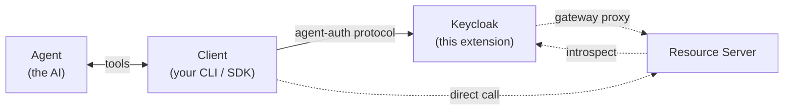
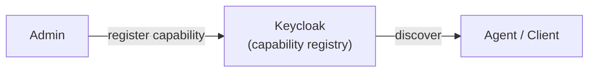

# Keycloak Agent Auth Protocol Extension

A Keycloak extension implementing the [Agent Auth Protocol v1.0-draft](https://agent-auth-protocol.com/), which establishes AI agents as first-class principals with their own identity, scoped capabilities, and independent lifecycle.

## Why Keycloak?

Keycloak already provides what Agent Auth needs: realms, users, sessions, tokens, audit events, and an admin API. This extension adds the agent-auth concepts on top — hosts, agents, capability grants — and reuses Keycloak primitives where it can:

- **Approval flows** reuse Keycloak user sessions: device-authorization (§7.1) and CIBA push (§7.2).
- **Multi-tenant capability registries** reuse Keycloak Organizations and realm roles. Grants revoke automatically when a user leaves an org.

## Architecture

**Hybrid model** — Keycloak handles auth; the resource server handles capability execution.



- **Client** — the process holding the host keypair and signing JWTs. Your CLI, SDK, or background worker.
- **Agent** — the AI loop inside the Client. Requests capabilities through tool calls (MCP, SDK functions); never talks to Keycloak directly.

Solid edges happen on every call; dashed edges are mode-specific (gateway vs direct). Host-scoped calls (register, status, revoke, rotate-key) carry a `host+jwt`; agent-scoped calls (execute, introspect) carry an `agent+jwt`. The full sequence walkthrough lives in [docs/architecture.md](docs/architecture.md).

### Endpoints

Endpoints are grouped by who calls them. Two SPI roots host all paths; each subsection states its base.

- **Realm-scoped:** `/realms/{realm}/agent-auth/` — protocol traffic from clients, agents, end users, and resource servers.
- **Admin-scoped:** `/admin/realms/{realm}/agent-auth/` — administrative endpoints requiring `manage-realm` (realm admin) or `manage-organization` (org admin).
- **Discovery** uses Keycloak's standard well-known mechanism, not the agent-auth path: `GET /realms/{realm}/.well-known/agent-configuration`.

#### Liveness (anyone)

Base: `/realms/{realm}/agent-auth/`

| Method | Path | Description |
|--------|------|-------------|
| GET | `health` | Liveness probe; confirms the extension is loaded |

#### Client / SDK (host or agent JWT)

Base: `/realms/{realm}/agent-auth/`. Host-scoped calls carry a `host+jwt`; agent-scoped calls carry an `agent+jwt`.

| Method | Path | Description |
|--------|------|-------------|
| POST | `agent/register` | Register agent under a host |
| GET  | `agent/status` | Check agent status + grants |
| GET  | `agent/{agentId}/capabilities/{capabilityName}/status` | Poll a pending grant while it awaits approval |
| POST | `agent/revoke` | Permanently revoke an agent |
| POST | `agent/reactivate` | Reactivate an expired agent |
| POST | `agent/rotate-key` | Replace agent's public key (host+jwt signed with the host key) |
| POST | `agent/request-capability` | Request additional capabilities |
| POST | `host/revoke` | Revoke host + cascade to all agents |
| POST | `host/rotate-key` | Replace host's public key (signed with the old key) |
| GET  | `capability/list` | List available capabilities |
| GET  | `capability/describe` | Get full capability schema |
| POST | `capability/execute` | Gateway execution: Keycloak introspects the agent JWT, runs constraint checks, and proxies to `capability.location` |

#### Resource server

Base: `/realms/{realm}/agent-auth/`

| Method | Path | Description |
|--------|------|-------------|
| POST | `agent/introspect` | Validate an agent JWT (RFC 7662 model). Optional `{capability, arguments}` runs constraint checks server-side. |

#### End user (browser approval flow)

Base: `/realms/{realm}/agent-auth/`. All endpoints require an authenticated realm user (Keycloak identity cookie or `Authorization: Bearer <user-access-token>`).

| Method | Path | Description |
|--------|------|-------------|
| GET  | `verify` | Browser-facing HTML approval page (the URL published as `verification_uri`). Bounces through realm login when no fresh identity cookie, then renders an approval form bound to the supplied `user_code`. |
| POST | `verify` | Form-encoded companion to the page: `user_code + decision + access_token` → HTML success/failure page. CSRF double-submit. |
| POST | `verify/approve` | JSON approve (§7.1). Activates the agent and links the host to the approving user. The entitlement gate flips grants whose cap fails the user's org/role check to `denied(insufficient_authority)`. |
| POST | `verify/deny` | JSON deny. Terminal — subsequent approve attempts return 410. |
| GET  | `inbox` | Pending approvals routed to the user via CIBA push (§7.2). In-realm fallback when SMTP isn't configured. |

#### Realm admin (`manage-realm`)

Base: `/admin/realms/{realm}/agent-auth/`

| Method | Path | Description |
|--------|------|-------------|
| POST   | `capabilities` | Register a realm-wide capability |
| PUT    | `capabilities/{name}` | Update a realm-wide capability |
| DELETE | `capabilities/{name}` | Delete a realm-wide capability |
| POST   | `hosts` | Pre-register a host with an inline Ed25519 JWK (§2.8). Optional `client_id` resolves a service-account user as the host owner so autonomous workloads skip the post-claim approval flow. |
| GET    | `hosts/{id}` | Fetch a host record by thumbprint |
| POST   | `hosts/{id}/link` | Bind host → user (§2.9). Cascades: autonomous agents → `claimed` with grants revoked (§2.10); delegated agents inherit `user_id` (§3.2). |
| DELETE | `hosts/{id}/link` | Remove the host→user binding. Revokes delegated agents; autonomous agents stay `claimed` (terminal). |
| GET    | `agents/{id}` | Fetch an agent record by id |
| GET    | `agents/{id}/grants` | Rows from the `AGENT_AUTH_AGENT_GRANT` secondary index — verifies the index stays in sync with the per-agent grant blob |
| POST   | `agents/{id}/capabilities/{capability}/approve` | Approve a pending capability grant |
| POST   | `agents/{id}/expire` | Force-expire an active agent |
| POST   | `agents/{id}/reject` | Reject a pending agent (terminal) |
| POST   | `pending-agents/cleanup` | Manual GC sweep for stale pending agents and the orphan pending hosts left behind by abandoned dynamic registrations. Also runs hourly per JVM. Optional `?olderThanSeconds=` overrides the default threshold. Returns `{removed, removed_agents, removed_hosts, threshold_seconds}` (`removed` is the sum). |

#### Org admin (`manage-organization` + member of the target org)

Base: `/admin/realms/{realm}/agent-auth/`. `organization_id` is derived from the path; the body can't override it. Cross-org PUT/DELETE returns 404.

| Method | Path | Description |
|--------|------|-------------|
| POST   | `organizations/{orgId}/capabilities` | Register an org-scoped capability |
| GET    | `organizations/{orgId}/capabilities` | List org-scoped capabilities |
| PUT    | `organizations/{orgId}/capabilities/{name}` | Update an org-scoped capability |
| DELETE | `organizations/{orgId}/capabilities/{name}` | Delete an org-scoped capability |
| POST   | `organizations/{orgId}/hosts` | Pre-register a host. Org-admin counterpart to `POST /hosts` — resolves `client_id` against a service-account user already in the org so the host inherits org-membership cascades. |
| POST   | `organizations/{orgId}/agent-environments` | Self-serve provisioning: creates a locked-down confidential client (no redirect URIs, only `client_credentials`), adds its service-account user to the org, and pre-registers the host. Returns `client_secret` once. Cap: 50 managed clients per org. |
| GET    | `organizations/{orgId}/agent-environments` | List managed agent-environment clients |
| DELETE | `organizations/{orgId}/agent-environments/{clientId}` | Delete a managed agent-environment client and its host record |

### What the resource server does

The resource server hosts each capability's business logic at the URL stored in `capability.location`. It can be written in any language. For each request it should verify the JWT `aud` matches its own capability URL, call Keycloak's `POST /agent/introspect` with `{"token":"..."}` (or `{"token":"...","capability":"...","arguments":{...}}` to run constraint checks server-side), and reject when `active` is `false` or `violations` is present and non-empty. Resource servers that don't want to implement introspection can use **gateway** mode instead and let Keycloak proxy.

### Execution modes

The agent picks per call:

- **Gateway** — `POST /capability/execute` to Keycloak with `{capability, arguments}`. Keycloak introspects the agent JWT, runs constraint checks, and proxies to `capability.location`. The resource server doesn't need to introspect. Synchronous, async-pending (`202 + status_url`), and SSE streaming responses are all proxied.
- **Direct** — `POST` straight to `capability.location` with the agent JWT in `Authorization`. The resource server calls `/agent/introspect` itself. Useful when the resource server already runs its own auth or wants to avoid an extra hop.

### Protocol actors

The spec defines five actors; this extension implements one (Server). The others plug in around Keycloak.

| Actor | Role | Implementation note |
|-------|------|---------------------|
| **Agent** (§2.1) | Runtime AI actor scoped to a conversation/task. Doesn't hold keys itself. | Yours — any LLM/runtime. Lifecycle states: `pending`, `active`, `expired`, `revoked`, `rejected`, `claimed`. |
| **Client** (§1.5) | Process that holds the host keypair, exposes protocol tools (MCP/CLI/SDK) to agents, signs JWTs, and speaks HTTP to the server. | Yours — any language. One client install ≡ one host identity. |
| **Host** (§2.7) | Persistent identity of the client environment (Ed25519 keypair + metadata). A principal the client holds, not an actor. | Stored in `AGENT_AUTH_HOST`. |
| **Server** (§1.5) | Authorization server: discovery, registration, approvals, grants, introspection, gateway execution. | **This extension + Keycloak core.** |
| **Resource server** (§1.5, §2.15) | Hosts a capability's business logic at `capability.location`. Validates agent JWTs locally or via `/agent/introspect`. | Yours — any language. |
| **User** (implicit) | Human who approves delegated registrations and grants. | A Keycloak realm user. Hosts get bound to users via the admin link API or implicitly when the user approves a device-flow registration; CIBA emails the linked user a deep link to the approval page. |

For the full sequence walkthrough, internals diagram, and per-concept source mapping, see [docs/architecture.md](docs/architecture.md).

## Capabilities

Capabilities are registered in Keycloak by administrators. Keycloak is the single source of truth for what capabilities exist, who can see them, and which agents have grants.



Each capability record carries:

| Field | Description |
|-------|-------------|
| `name` | Stable identifier (`check_balance`, `transfer_money`) |
| `description` | Human-readable explanation |
| `location` | URL where the resource server executes the capability. If omitted, clients fall back to `default_location` from discovery (§2.15 / §5.1). Capabilities without a location appear in discovery and grants but can't be proxied through gateway mode. |
| `input` / `output` | JSON Schema for arguments and results |
| `visibility` *(extension)* | `public` (visible to anyone) or `authenticated` (visible to realm users only) |
| `requires_approval` *(extension)* | Whether user approval is needed before granting |
| `organization_id` | Optional Keycloak organization id. When set, only that org's members can see or be granted the cap. NULL = realm-wide. |
| `required_role` | Optional realm role name. When set, only callers holding the role can be granted. NULL = no role gate. |

### Multi-tenant scoping

`organization_id` and `required_role` compose into one entitlement gate: a caller passes when both `(cap.organization_id IS NULL OR caller ∈ cap's org)` and `(cap.required_role IS NULL OR caller has cap.required_role)` hold. Public-visibility caps bypass the gate (anonymous callers have nothing to match against).

The gate runs at three points:

- **Discovery** — `/capability/list` and `/capability/describe` filter caps the caller can't see.
- **Approval** — `/verify/approve` flips grants whose cap fails the approver's entitlement to `denied(insufficient_authority)`; passing grants go `active`.
- **Introspection** — `/agent/introspect` strips grants whose cap the agent's user no longer entitles (the lazy half of the cascade).

The eager half: `OrganizationModel.OrganizationMemberLeaveEvent` triggers immediate revocation of a leaving user's grants whose cap belongs to that org, with `reason=org_membership_removed`.

The Keycloak Organizations feature is required for org-scoped caps end-to-end. Without it, caps with `organization_id IS NULL` continue to work; caps with a set `organization_id` become invisible (fail-safe — no leakage when the feature isn't enabled).

### Constraints

Grants can carry constraints that restrict what arguments the agent can supply:

```json
{
  "capability": "transfer_money",
  "status": "active",
  "constraints": {
    "amount": { "min": 0, "max": 1000 },
    "currency": { "in": ["USD", "EUR"] },
    "destination_account": "acc_456"
  }
}
```

Supported operators: `max`, `min`, `in`, `not_in`, and exact-value match. Constraints run in two places — gateway-mode `/capability/execute` (returns `403 constraint_violated`) and `/agent/introspect` when the resource server passes `{token, capability, arguments}` (returns a `violations[]` array).

### Auto-grant

Two orthogonal signals can skip the user-approval prompt for a delegated agent's grant:

- **Per-cap `requires_approval=false`** — admin marks this cap as universally low-risk.
- **Per-host `default_capabilities`** — a set of cap names on the host record, populated when prior grants get approved. A subsequent registration under the same host that requests a cap already in the set auto-approves (§3.1, §5.3 auto-approval rule).

A grant auto-approves when the entitlement gate passes AND (`!requires_approval` OR cap is in the host's `default_capabilities`).

## Identity and keys

Hosts and agents use Ed25519 keypairs. Registration provides keys either inline as a public JWK (`host_public_key`, `agent_public_key`) or by reference with a JWKS URL (`host_jwks_url`, `agent_jwks_url`). Inline and JWKS URL are mutually exclusive per identity, and `agent_kid` is required when `agent_jwks_url` is used.

JWKS-based identities are cached in-process for 5 minutes. A `kid` miss triggers one refetch per URL, rate-limited to once per 10 seconds. JWKS fetches require HTTPS, except for localhost and container-test hostnames used by local development and integration tests — intentionally stricter than the spec's URL-fetching guidance.

Inline-key identities rotate through the explicit endpoints (`/agent/rotate-key`, `/host/rotate-key`); JWKS-based identities rotate by publishing the new key at the JWKS URL.

This extension does not sign protocol responses, so discovery does not publish a server `jwks_uri` and `/agent-auth/jwks` is not exposed. Host and agent JWKS support is independent of any future server-response signing.

## Key design decisions

| Decision | Choice | Rationale |
|----------|--------|-----------|
| Architecture | Hybrid (Keycloak does auth, resource server executes) | Avoids building a parallel auth system inside Keycloak. |
| Discovery | `/realms/{realm}/.well-known/agent-configuration` via `WellKnownProvider` SPI | Follows Keycloak's OpenID discovery pattern. |
| Crypto | Nimbus JOSE+JWT for Ed25519 | Already on Keycloak's classpath, well-audited. |
| Storage | JPA entities + Liquibase changelog via `JpaEntityProvider` SPI; writes land in Keycloak's main persistence unit (H2 in dev, any RDBMS Keycloak supports in prod). Selected by default through the `agent-auth-storage` SPI; set `kc.spi.agent-auth-storage.provider=in-memory` to switch back to the process-local map for tests. | Survives Keycloak restarts and scales across replicas. Indexed `ORGANIZATION_ID` and `REQUIRED_ROLE` make multi-tenant filtering and cascades SQL-efficient. The `AGENT_AUTH_AGENT_GRANT` table is a sync-on-write secondary index over per-agent grants used by the eager cascade. |
| Approval flows | Device-authorization (§7.1), CIBA push (§7.2 — email + in-realm `/inbox` fallback), and admin-mediated HTTP approval | Device flow reuses the realm's user authentication for the `user_code` step; CIBA emails the linked user a deep link to `/verify/approve`; the admin path covers headless setups. |
| Capabilities | Centralized in Keycloak, optionally org-scoped | Single source of truth; resource servers just execute. Multi-tenancy via Keycloak Organizations + realm roles. |

## Protocol reference

This extension implements [Agent Auth Protocol v1.0-draft](https://agent-auth-protocol.com/specification).

- **Host** — persistent identity of the client environment (Ed25519 keypair).
- **Agent** — per-task identity scoped to a conversation, with its own keypair, lifecycle, and grants.
- **`host+jwt` / `agent+jwt`** — short-lived Ed25519-signed JWTs (EdDSA, RFC 8037). `host+jwt` audiences the issuer URL. `agent+jwt` audiences the resolved capability location (`capability.location` if set, else `default_location`) when calling for execution, and the issuer URL for non-execution calls to the auth server, per §4.3.
- **Delegated mode** — agent acts on behalf of a user who approves grants.
- **Autonomous mode** — agent operates without a user in the loop (typically backed by a service-account host).
- **Approval methods advertised in discovery** — `device_authorization`, `ciba` (both core spec methods), plus `admin` (server-defined per §5.1's "additional custom methods" allowance).

## Development

### Prerequisites

- Java 21+
- Maven 3.9+
- Docker (for integration tests)

### Build

```bash
mvn package -Pquick   # compile + package, skip tests
mvn test              # unit tests
mvn verify            # unit + integration tests (starts Keycloak in Docker)
```

### Commit messages

This repository uses Conventional Commits. Install the hook to enforce locally:

```bash
./scripts/install-hooks.sh
```

The hook rejects commit subjects that don't match `feat: ...`, `fix(scope): ...`, etc. Releases and changelog generation are handled by release-please; release-asset uploads are verified in GitHub Actions.

### Local development with Docker Compose

```bash
docker compose up
```

Keycloak comes up at `http://localhost:28080` with the extension preloaded. Agent-auth endpoints live at `/realms/{realm}/agent-auth/...`.

The Dockerfile is multi-stage. The builder runs `mvn package` against the checked-in source; the runtime stage copies the extension JAR plus its runtime libs (nimbus-jose-jwt, tink) from `target/provider-libs/` into `/opt/keycloak/providers/`. No host JDK or Maven required. Integration tests use the same `target/provider-libs/` directory via Testcontainers, so the image and the test harness share one source of truth for runtime deps.
