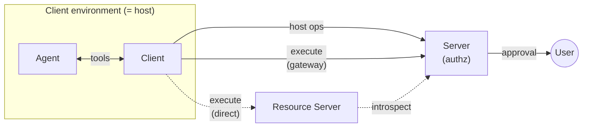
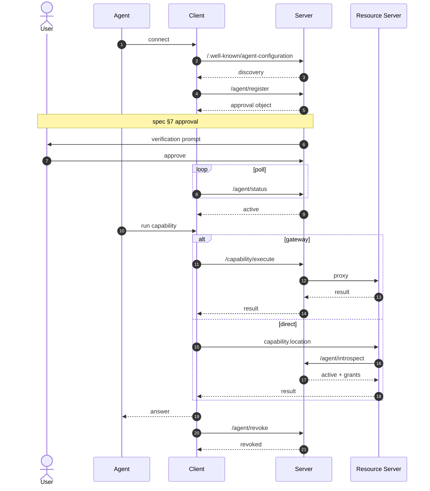
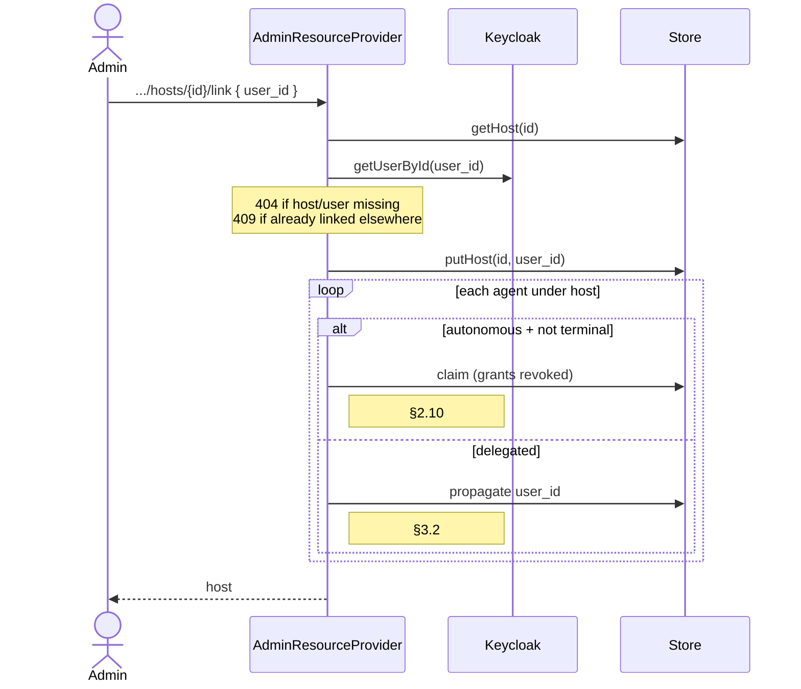
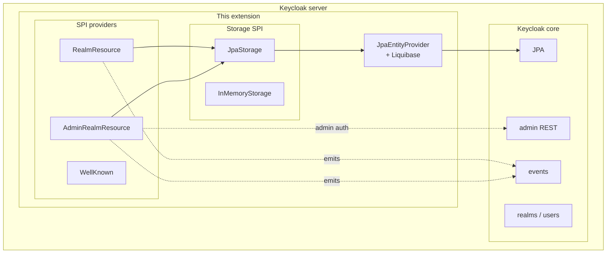

# Architecture

This document maps the [Agent Auth Protocol v1.0-draft](https://agent-auth-protocol.com/specification/v1.0-draft) onto this Keycloak extension. It's aimed at someone who's read the spec once and wants to know how our code cuts it up, or someone who's read our code and wants to know where each piece lives in the spec.

The README gives the high-level picture; this doc is the deep reference.

## Contents

1. [Protocol actors](#protocol-actors)
2. [Spec architecture](#spec-architecture)
3. [Canonical happy-path sequence](#canonical-happy-path-sequence)
4. [Host linking flow](#host-linking-flow)
5. [Extension internals](#extension-internals)
6. [Spec ↔ source file map](#spec--source-file-map)
7. [Deliberate deviations and choices](#deliberate-deviations-and-choices)

---

## Protocol actors

| Actor | Kind | Definition (verbatim quote, spec section) |
|-------|------|-------------------------------------------|
| **Agent** | service | "A runtime AI actor scoped to a specific conversation, task, or session, that calls external services." (§2.1) |
| **Client** | service | "The process that holds a host identity and exposes protocol tools to AI systems (MCP server, CLI, SDK). It manages host and agent keys, talks to servers, and signs JWTs." (§1.5) |
| **Host** | principal | "The persistent identity of the client environment where agents run... represented as a registered keypair plus metadata." (§2.7) |
| **Server** | service | "The service's authorization server. It manages discovery, host and agent registrations, approvals, capability grants, and JWT verification." (§1.5) |
| **Resource Server** | service | Implicit in §2.15 and §5.11. The service hosting a capability's business logic at `capability.location`. Validates agent JWTs locally or via introspection. |
| **User** | human | End user who approves delegated registrations and capability grants (§2.2.1, §2.9). Linked to hosts through the server's implementation-specific linking mechanism (§2.9). |

Key property: **Client and Host are different things.** The client is the process (Claude Code CLI, a background worker, etc.); the host is the identity that client holds (one Ed25519 keypair + record on the server). Migrating a client install to a different machine but carrying the key = same host; reinstalling with a fresh key = different host.

## Spec architecture

Solid edges happen in every session; dashed edges are one of two execution-mode alternatives. Every edge into or out of the Server is HTTP + JWT:

- **host ops** — register, status, revoke, reactivate, rotate-key, plus list/describe. Bearer token is a `host+jwt`.
- **execute (gateway)** — `POST /capability/execute` with `agent+jwt`; server validates, runs constraint checks, proxies to `<capability.location>`. Resource server never sees an agent+jwt.
- **execute (direct)** — `POST <capability.location>` with `agent+jwt` straight from the client.
- **introspect** — `POST /agent/introspect` server-to-server from the resource server; only used in direct mode.
- **approval** — the approval method advertised in `/.well-known/agent-configuration`. Currently `device_authorization` and `admin`; `ciba` is on the roadmap.

Gateway is the simpler integration (resource server doesn't implement any auth); direct gives the resource server ownership of the auth decision and saves one hop.

## Canonical happy-path sequence

Delegated-mode registration → approval → execution → introspection → revocation.

A few nuances worth calling out:

- **Host+jwt vs agent+jwt boundary.** Host+jwt signs *host-scoped* operations (register, status, revoke, reactivate, rotate-key). Agent+jwt signs *agent-scoped* operations (execute, introspect target). The agent+jwt's `aud` requirement differs by mode: **gateway mode** (`/capability/execute`) requires the aud to contain `<issuerUrl>/capability/execute` — see `executeCapability`'s aud check; **direct mode** uses the issuer URL itself (`.../realms/{realm}/agent-auth`) — that's what AAP §4.3 specifies and what `/agent/introspect` verifies. The host+jwt and other agent-token uses (introspect, status, rotate-key, revoke) all check `aud=issuerUrl`. Resource servers in direct mode rely on the introspect response (plus any application-layer check they want against their own URL) to confirm the token was minted to be introspected by this server.
- **Approval method selection.** Driven by what the server advertises in `/.well-known/agent-configuration` under `approval_methods`. Today we publish `["device_authorization", "ciba", "admin"]`. For `device_authorization` (AAP §7.1), the server returns a `user_code`, `verification_uri`, and `status_url` in the approval object; the user authenticates to the realm and POSTs the code to `/verify/approve` or `/verify/deny`. Approval also links the host to the approving user per §2.9. For `ciba` (AAP §7.2), the server emails the linked user a deep link back to the approval page; users without SMTP configured can poll `/agent-auth/inbox` as the in-realm fallback channel. For `admin`, the flow in step 6 is a Keycloak admin calling `/admin/.../agents/{id}/capabilities/{cap}/approve`.
- **Layer-2 enforcement at approval time.** Phase 2 of the multi-tenant authz plan inserts an org/role check inside `/verify/approve`. Approving user's KC entitlement is checked against each pending grant's cap; gate-failed grants flip to `denied(insufficient_authority)` instead of `active`. The agent itself still transitions per §5.3 — same partial-approval shape as today's `user_denied` path.
- **Async / streaming execution.** Gateway-mode `/capability/execute` can return `202 + status_url` for async or an SSE stream for streaming. `AgentAuthRealmResourceProvider.executeCapability` proxies all three response shapes; see `AgentAuthCapabilityExecuteIT` for the exercised contracts.

## Host linking flow

Host linking is the spec's mechanism for binding a host (machine identity) to a user (human identity). §2.9 says linking is implementation-specific; this extension ships two paths: the admin API (`POST/DELETE /admin/.../hosts/{id}/link`) and implicit linking on device-authorization approval (`/verify/approve` links the host to the approving realm user, AAP §7.1). CIBA is **not** a linking trigger by design — `selectApprovalObject` only routes to CIBA when the host is already linked (so the server knows which user to email); unlinked hosts fall through to device flow, which is the linking path. If you want CIBA to also serve as a linking trigger (e.g. a workload-provided user hint that mints an approval email to a specific user), that's a feature extension on top of §2.9, not a closure of a spec gap.

Unlink (`DELETE /admin/.../hosts/{id}/link`) runs the inverse cascade: all delegated agents under the host are revoked (§2.9 — their authority derived from the now-removed link). Autonomous agents were already `claimed` by the link cascade, which is a terminal state, so they stay put. The host's `user_id` is cleared and it becomes unlinked again.

Coverage: `AgentAuthHostLinkIT` walks each of the spec's normative consequences (§2.9 one-user constraint, §2.10 claim cascade, §3.2 user_id propagation, §2.9 unlink revocation) against a live Keycloak container.

## Extension internals

Three SPI providers (the only extension points Keycloak itself defines) sit above a storage SPI with a JPA default and an in-memory fallback; JPA entities + a Liquibase changelog flow into Keycloak's own persistence unit. Admin-auth reuse and admin-event emission are the two ways the extension plugs back into core. Concrete class names live in [the spec ↔ source map below](#spec--source-file-map); a few helper classes (`JwksCache`, `ConstraintValidator`, `DiscoveryCacheFilter`) are called from the providers but aren't pictured here.

### Storage layering

`AgentAuthStorage` is the single interface through which every endpoint reaches state. Two implementations ship:

- `JpaStorage` — default, order=100. Writes land in Keycloak's main persistence unit via `JpaEntityProvider`. One Liquibase changelog (`META-INF/agent-auth-changelog.xml`) creates the four tables. All four entities use typed columns — `AGENT_AUTH_HOST`, `AGENT_AUTH_AGENT`, `AGENT_AUTH_CAPABILITY`, `AGENT_AUTH_AGENT_GRANT`. The earlier `PAYLOAD TEXT` JSON-blob shape was promoted to typed columns in Phases 6a–c of the multi-tenant authz plan; round-trip is via `{entity}ToMap` / `apply{Entity}Fields` helpers in `JpaStorage`. Schema-shaped fields (input/output schema, public_key JWK, approval object, default_capability_grants) stay serialized as TEXT JSON since they're recursive or open-ended; ordinary scalars are typed columns. Indexed `ORGANIZATION_ID` and `REQUIRED_ROLE` on capability make Phase 1's user-entitlement filter and Phase 4's eager cascade SQL-efficient.
- `AGENT_AUTH_AGENT_GRANT` is a normalized join table (composite PK `(agent_id, capability_name)`) maintained as a sync-on-write secondary index over the agent's `agent_capability_grants` JSON list. The application read path still goes through the per-agent JSON; the table backs the `findGrantsByAgent` SPI method, the `GET /admin/.../agents/{id}/grants` endpoint, and Phase 4's cascade lookups. Sync is skipped on putAgent calls where the grants array hasn't changed (e.g. `/capability/execute` updating `last_used_at`), avoiding lock contention with concurrent writes.
- `InMemoryStorage` — order=0, used by tests that don't care about persistence. Most ITs use it; `BasePostgresE2E` switches to JPA+Postgres for cross-restart tests.

Providers are selected with `kc.spi.agent-auth-storage.provider=<jpa|in-memory>`.

### JWT verification

Two keyed verification paths:

- **Inline key** — the host+jwt or the registered agent record contains a JWK. Signature verification reads the key directly.
- **JWKS URL** — `host_jwks_url` or `agent_jwks_url` is registered; `JwksCache` fetches and caches. 5-minute TTL; a `kid` miss triggers one refetch per URL per 10 seconds.

Both paths converge in the same verification logic; the choice is per-identity, fixed at registration time, and mutually exclusive for the same identity.

### Constraint enforcement

`ConstraintValidator` enforces `max` / `min` / `in` / `not_in` / exact-scalar constraints declared on a grant. Evaluation happens in two places:

- Gateway mode (`/capability/execute`) — before proxying, Keycloak checks arguments and returns `403 constraint_violated` with a `violations[]` array.
- Introspection-assisted direct mode — resource servers POST `{token, capability, arguments}` to `/agent/introspect`; if constraints fail, the introspection response carries a `violations` field, and the resource server is expected to reject.

## Spec ↔ source file map

| Spec section / concept | Implementation |
|------------------------|----------------|
| §5.1 Discovery | `AgentAuthWellKnownProvider` + `AgentAuthWellKnownProviderFactory` |
| §5.2 / §5.2.1 Capability list / describe | `AgentAuthRealmResourceProvider.listCapabilities` / `.describeCapability` |
| §5.3 Agent registration | `AgentAuthRealmResourceProvider.registerAgent` |
| §5.4 Request capability | `AgentAuthRealmResourceProvider.requestCapability` |
| §5.5 Status | `AgentAuthRealmResourceProvider.getAgentStatus` and `.getGrantStatus` |
| §5.6 Reactivate | `AgentAuthRealmResourceProvider.reactivateAgent` |
| §5.7 / §5.10 Revoke agent / host | `AgentAuthRealmResourceProvider.revokeAgent` / `.revokeHost` |
| §5.8 / §5.9 Key rotation | `AgentAuthRealmResourceProvider.rotateAgentKey` / `.rotateHostKey` |
| §5.11 Execute (gateway) | `AgentAuthRealmResourceProvider.executeCapability` |
| §5.12 Introspect | `AgentAuthRealmResourceProvider.introspect` |
| §4.5 JWT verification | inline in the above, shared helpers |
| §2.13 Constraints | `ConstraintValidator`, `ConstraintViolation` |
| §2.8 Pre-registration | `AgentAuthAdminResourceProvider.preRegisterHost` / `.getHost` |
| §2.9 / §2.10 / §3.2 Host linking + claiming + user_id propagation | `AgentAuthAdminResourceProvider.linkHost` / `.unlinkHost` |
| §7.1 Device-authorization approval | `AgentAuthRealmResourceProvider.verifyApprove` / `.verifyDeny` — approves or denies a pending agent by `user_code`; approval implicitly links the host to the approving user. Phase 2 layer-2 gate runs inside the same flow. |
| §7.2 CIBA push approval | `AgentAuthRealmResourceProvider.inbox` (in-realm poll) + `notify/CibaEmailNotifier` (email channel). Approval lands at the same `verifyApprove` site. |
| §2.6 User-deletion cascade | `AgentAuthUserEventListenerProviderFactory.handleUserRemoved` — listens to `UserModel.UserRemovedEvent` and revokes hosts/agents under the deleted user. |
| Multi-tenant org-membership cascade (Phase 4) | `AgentAuthUserEventListenerProviderFactory.handleOrgMemberLeave` — listens to `OrganizationModel.OrganizationMemberLeaveEvent` and revokes grants whose cap matches the removed org. |
| Multi-tenant user-entitlement filter (Phase 1) | `AgentAuthRealmResourceProvider.userEntitlementAllows` (gate predicate) + `loadUserEntitlement` (snapshot helper) — applied on `/capability/list`, `/capability/describe`, and `/verify/approve`. |
| Multi-tenant introspect re-eval (Phase 2) | Inline filter in `AgentAuthRealmResourceProvider.introspect` — strips grants whose cap fails the agent user's current org/role entitlement. |
| Admin capability CRUD (realm-wide) | `AgentAuthAdminResourceProvider.registerCapability` / `.updateCapability` / `.deleteCapability` |
| Admin capability CRUD (org-scoped, Phase 5) | `AgentAuthAdminResourceProvider.registerOrgCapability` / `.listOrgCapabilities` / `.updateOrgCapability` / `.deleteOrgCapability`, gated by `requireOrgAdmin` |
| Admin grant approve / reject / expire | `AgentAuthAdminResourceProvider.approveCapability` / `.rejectAgent` / `.expireAgent` |
| Admin grants secondary-index probe | `AgentAuthAdminResourceProvider.getAgentGrants` |
| SA-as-host (Phase 5) | `AgentAuthAdminResourceProvider.preRegisterHost` — optional `client_id` resolves the confidential client's service-account user as host owner |
| Org-self-serve agent environments | `AgentAuthAdminResourceProvider.createOrgAgentEnvironment` / `.listOrgAgentEnvironments` / `.deleteOrgAgentEnvironment` — creates a locked-down KC client + binds its SA to the path's org + pre-registers the host in one `manage-organization` call. Lockdown flags are hard-coded; managed clients are tagged `agent_auth_managed=true` and `agent_auth_organization_id=<orgId>` for queryable audit/cleanup. List returns the org's envs without `client_secret` (secrets are one-time-only on create). Quota: 50 managed clients per org. |
| Storage | `storage/AgentAuthStorage` + `storage/jpa/*` (typed columns + `AGENT_AUTH_AGENT_GRANT` secondary index) + `storage/InMemoryStorage` |
| Liquibase schema | `META-INF/agent-auth-changelog.xml` |

Tests mirror the endpoint boundaries: one `*IT.java` per spec section in `src/test/java/.../agentauth/`, plus `AgentAuthFullJourneyE2E` and `AgentAuthRestartSurvivalE2E` for cross-endpoint invariants.

## Deliberate deviations and choices

The spec is intentionally implementation-agnostic in several places. Here's where we picked and why.

| Spec concept | What we did | Why |
|--------------|-------------|-----|
| `approval_methods` | `["device_authorization", "ciba", "admin"]` | `device_authorization` (AAP §7.1) is implemented on top of Keycloak user sessions: the client receives a `user_code`, the approving realm user posts it to `/verify/approve` (or `/verify/deny`), and the host is linked to that user per §2.9. `ciba` (AAP §7.2) emails the linked user with a deep link to the approval page; the in-realm `/inbox` poll is the SMTP-less fallback. `admin` remains available for headless setups (`POST /admin/.../agents/{id}/capabilities/{cap}/approve`). |
| Host state on dynamic registration | `active` (spec prescribes `pending`) | Pre-existing simplification. Approval gating happens at the agent/grant level — for delegated mode with approval-required capabilities, the agent JWT is not usable until a device-flow or admin approval lands, so the user-visible behavior still requires a human. Revisit if we need to enforce host-pending state distinctly from agent-pending. |
| Pre-registration endpoint shape | `POST /admin/.../agent-auth/hosts` with inline JWK | Spec explicitly defers this to "server's dashboard, admin API, or any other server-specific mechanism" (§2.8). We matched the shape of the existing admin API. |
| `user_id` linking on hosts (§2.9) | **Implemented** via two paths: admin API (`POST/DELETE /admin/.../agent-auth/hosts/{id}/link`) and implicit on device-flow approval (`/verify/approve` links the host to the approving user). | §2.9 is mechanism-agnostic about which approval methods trigger linking. CIBA is intentionally not a linking trigger — `selectApprovalObject` routes to CIBA only when the host is already linked (so the server has an email recipient); unlinked hosts go through device flow, which is the linking path. Adding workload-provided user hints to extend CIBA into a linking flow is a feature on top of §2.9, not a spec-gap closure. |
| Autonomous-agent `claimed` transition on host link (§2.10) | **Implemented** — link cascade claims autonomous agents, revokes their grants, propagates `user_id` to delegated agents (§3.2) | The normative consequences of linking are MUST-level in the spec; the admin endpoint enforces them and `AgentAuthHostLinkIT` covers each one. |
| `jwks_uri` in discovery | omitted | Extension doesn't sign server responses — nothing to publish. Host/agent JWKS support is separate and fully implemented. |
| JWKS HTTPS enforcement | stricter than spec (HTTPS required except for localhost and container-test hostnames) | Avoid accidentally fetching JWKS over cleartext in production. Dev/test exceptions are scoped narrowly. |
| Storage SPI | shipped (`AgentAuthStorage`) with JPA default | So persistence survives container restarts and scales across replicas without forcing any consumer onto a specific backend. |
| Multi-tenant capability registries | shipped via `organization_id` (KC Organizations) + `required_role` (realm role) on capability, with eager cascade on org-membership leave and lazy re-eval at introspect | Multi-tenancy was a real customer ask and falls out cleanly when KC's own primitives are wired in. The alternative — building an AAP-native ACL — would parallel work KC already does. |
| Org-self-serve agent environments | `POST /admin/.../organizations/{orgId}/agent-environments` creates a locked-down KC client + binds its SA to the org + pre-registers the host atomically, gated by `manage-organization`. The endpoint takes only `{name, host_public_key}` — every OIDC-flow flag is hard-coded false, so org admins can't repurpose the client for browser/auth flows. `client_secret` is returned exactly once and can't be retrieved later (rotate by deleting + recreating). Quota of 50 managed clients per org. Removing an org admin does **not** invalidate the secrets/keys they've already received — operators must rotate explicitly. KC native admin (manage-clients) can still mutate or delete these clients out-of-band; the extension only guards its own surface. | The realm-admin-only path forces every org SA-host through a human bottleneck, which leads to credential sharing and approval fatigue. Bounded delegation (limited blast radius via lockdown + tagging + quota) matches the IAM-role / GitHub-Apps pattern and is net-safer than the status quo. |
| Soft FKs to KC's `KEYCLOAK_USER` / `KEYCLOAK_ORG` / `KEYCLOAK_REALM` | string columns + application-level cascades (`AgentAuthUserEventListenerProviderFactory` for user-delete and org-leave) | Adding cross-package real FKs would tie our Liquibase changesets to KC's schema across version bumps; brittle. The cascade listeners cover the integrity story for now. Revisit if a stale-id orphan bug actually surfaces. |

If you hit one of these and need different behavior, open an issue — most of them are "waits on a sibling feature" rather than deliberate exclusion.
