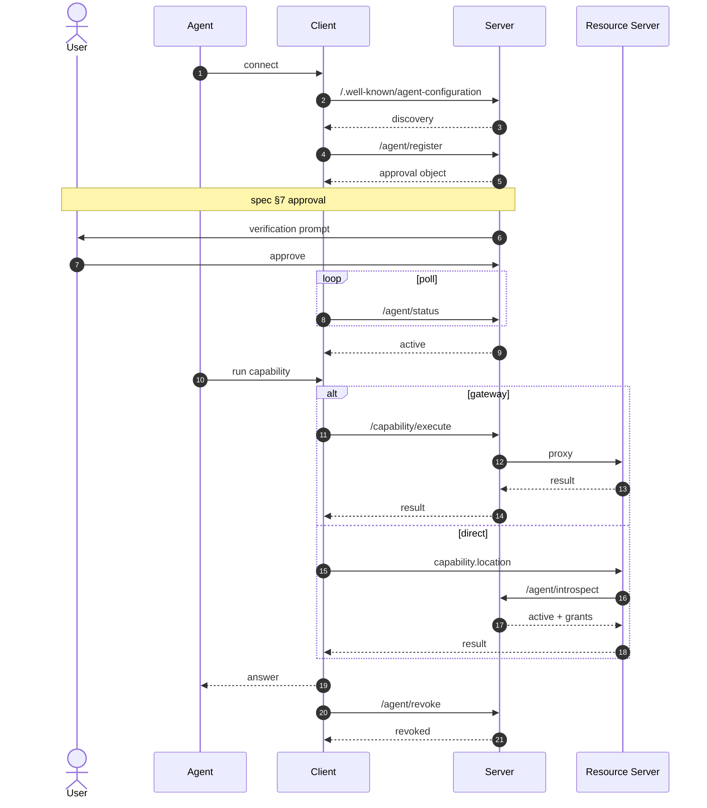
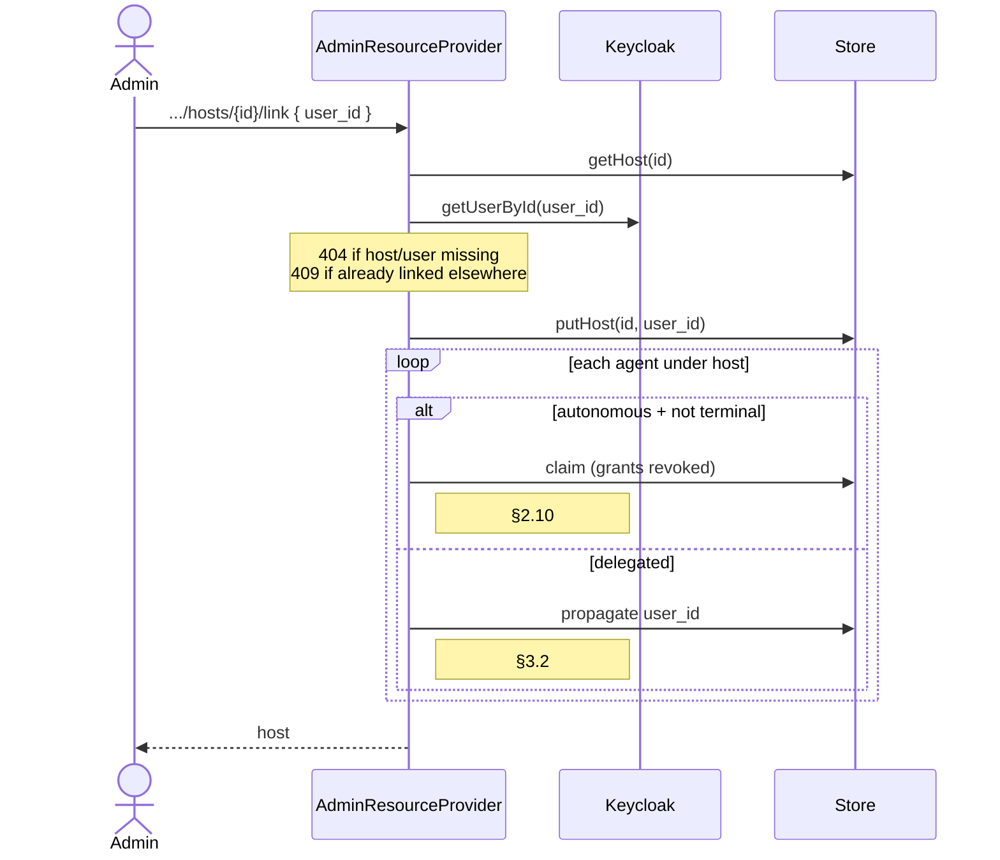
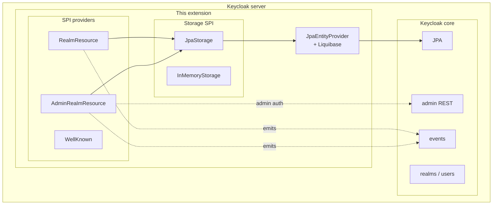

# Architecture

This document maps the [Agent Auth Protocol v1.0-draft](https://agent-auth-protocol.com/specification/v1.0-draft) onto this Keycloak extension. It's aimed at someone who's read the spec once and wants to know how our code cuts it up, or someone who's read our code and wants to know where each piece lives in the spec.

The README gives the high-level picture; this doc is the deep reference.

## Contents

1. [Protocol actors](#protocol-actors)
2. [Spec architecture](#spec-architecture)
3. [Canonical happy-path sequence](#canonical-happy-path-sequence)
4. [Host linking flow](#host-linking-flow)
5. [Extension internals](#extension-internals)
6. [Spec ↔ source file map](#spec--source-file-map)
7. [Deliberate deviations and choices](#deliberate-deviations-and-choices)

---

## Protocol actors

| Actor | Kind | Definition (verbatim quote, spec section) |
|-------|------|-------------------------------------------|
| **Agent** | service | "A runtime AI actor scoped to a specific conversation, task, or session, that calls external services." (§2.1) |
| **Client** | service | "The process that holds a host identity and exposes protocol tools to AI systems (MCP server, CLI, SDK). It manages host and agent keys, talks to servers, and signs JWTs." (§1.5) |
| **Host** | principal | "The persistent identity of the client environment where agents run... represented as a registered keypair plus metadata." (§2.7) |
| **Server** | service | "The service's authorization server. It manages discovery, host and agent registrations, approvals, capability grants, and JWT verification." (§1.5) |
| **Resource Server** | service | Implicit in §2.15 and §5.11. The service hosting a capability's business logic at `capability.location`. Validates agent JWTs locally or via introspection. |
| **User** | human | End user who approves delegated registrations and capability grants (§2.2.1, §2.9). Linked to hosts through the server's implementation-specific linking mechanism (§2.9). |

Key property: **Client and Host are different things.** The client is the process (Claude Code CLI, a background worker, etc.); the host is the identity that client holds (one Ed25519 keypair + record on the server). Migrating a client install to a different machine but carrying the key = same host; reinstalling with a fresh key = different host.

## Spec architecture

```mermaid
flowchart LR
    subgraph CE["Client environment (= host)"]
        direction LR
        A["Agent"]
        C["Client"]
        A <-->|tools| C
    end

    S["Server<br/>(authz)"]
    RS["Resource Server"]
    U(("User"))

    C -->|host ops| S
    C -->|execute<br/>(gateway)| S
    C -.->|execute<br/>(direct)| RS
    RS -.->|introspect| S
    S -->|approval| U
```

Solid edges happen in every session; dashed edges are one of two execution-mode alternatives. Every edge into or out of the Server is HTTP + JWT:

- **host ops** — register, status, revoke, reactivate, rotate-key, plus list/describe. Bearer token is a `host+jwt`.
- **execute (gateway)** — `POST /capability/execute` with `agent+jwt`; server validates, runs constraint checks, proxies to `<capability.location>`. Resource server never sees an agent+jwt.
- **execute (direct)** — `POST <capability.location>` with `agent+jwt` straight from the client.
- **introspect** — `POST /agent/introspect` server-to-server from the resource server; only used in direct mode.
- **approval** — the approval method advertised in `/.well-known/agent-configuration` (`device_authorization`, `ciba`, or `admin`).

Gateway is the simpler integration (resource server doesn't implement any auth); direct gives the resource server ownership of the auth decision and saves one hop.

## Canonical happy-path sequence

Delegated-mode registration → approval → execution → introspection → revocation.



A few nuances worth calling out:

- **Host+jwt vs agent+jwt boundary.** Host+jwt signs *host-scoped* operations (register, status, revoke, reactivate, rotate-key). Agent+jwt signs *agent-scoped* operations (execute, introspect target). The spec requires `aud` on the agent+jwt to match the endpoint it's sent to — `/capability/execute` for gateway, `<capability.location>` for direct. That's enforced in `AgentAuthRealmResourceProvider.executeCapability` and mirrored by resource-server implementations.
- **Approval method selection.** Driven by what the server advertises in `/.well-known/agent-configuration` under `approval_methods`. Today we publish `["admin"]`, so step 6 is a human admin calling `/admin/.../agents/{id}/capabilities/{cap}/approve`; `device_authorization` and `ciba` are on the roadmap.
- **Async / streaming execution.** Gateway-mode `/capability/execute` can return `202 + status_url` for async or an SSE stream for streaming. `AgentAuthRealmResourceProvider.executeCapability` proxies all three response shapes; see `AgentAuthCapabilityExecuteIT` for the exercised contracts.

## Host linking flow

Host linking is the spec's mechanism for binding a host (machine identity) to a user (human identity). §2.9 says linking is implementation-specific and lists "admin API" as one of the allowed mechanisms; this extension ships that admin API today. Interactive user-driven linking via device-flow or CIBA is still planned.



Unlink (`DELETE /admin/.../hosts/{id}/link`) runs the inverse cascade: all delegated agents under the host are revoked (§2.9 — their authority derived from the now-removed link). Autonomous agents were already `claimed` by the link cascade, which is a terminal state, so they stay put. The host's `user_id` is cleared and it becomes unlinked again.

Coverage: `AgentAuthHostLinkIT` walks each of the spec's normative consequences (§2.9 one-user constraint, §2.10 claim cascade, §3.2 user_id propagation, §2.9 unlink revocation) against a live Keycloak container.

## Extension internals



Three SPI providers (the only extension points Keycloak itself defines) sit above a storage SPI with a JPA default and an in-memory fallback; JPA entities + a Liquibase changelog flow into Keycloak's own persistence unit. Admin-auth reuse and admin-event emission are the two ways the extension plugs back into core. Concrete class names live in [the spec ↔ source map below](#spec--source-file-map); a few helper classes (`JwksCache`, `ConstraintValidator`, `DiscoveryCacheFilter`) are called from the providers but aren't pictured here.

### Storage layering

`AgentAuthStorage` is the single interface through which every endpoint reaches state. Two implementations ship:

- `JpaStorage` — default, order=100. Writes land in Keycloak's main persistence unit via `JpaEntityProvider`. One Liquibase changelog (`META-INF/agent-auth-changelog.xml`) creates the four tables. The entity shape is deliberately coarse: four tagged columns (`ID`, `STATUS`, `CREATED_AT`, `UPDATED_AT`) plus a `PAYLOAD TEXT` holding the full record as JSON. Adding optional fields to a record (name/description/metadata) is a zero-migration change — they ride along in `PAYLOAD`.
- `InMemoryStorage` — order=0, used by tests that don't care about persistence. Most ITs use it; `BasePostgresE2E` switches to JPA+Postgres for cross-restart tests.

Providers are selected with `kc.spi.agent-auth-storage.provider=<jpa|in-memory>`.

### JWT verification

Two keyed verification paths:

- **Inline key** — the host+jwt or the registered agent record contains a JWK. Signature verification reads the key directly.
- **JWKS URL** — `host_jwks_url` or `agent_jwks_url` is registered; `JwksCache` fetches and caches. 5-minute TTL; a `kid` miss triggers one refetch per URL per 10 seconds.

Both paths converge in the same verification logic; the choice is per-identity, fixed at registration time, and mutually exclusive for the same identity.

### Constraint enforcement

`ConstraintValidator` enforces `max` / `min` / `in` / `not_in` / exact-scalar constraints declared on a grant. Evaluation happens in two places:

- Gateway mode (`/capability/execute`) — before proxying, Keycloak checks arguments and returns `403 constraint_violated` with a `violations[]` array.
- Introspection-assisted direct mode — resource servers POST `{token, capability, arguments}` to `/agent/introspect`; if constraints fail, the introspection response carries a `violations` field, and the resource server is expected to reject.

## Spec ↔ source file map

| Spec section / concept | Implementation |
|------------------------|----------------|
| §5.1 Discovery | `AgentAuthWellKnownProvider` + `AgentAuthWellKnownProviderFactory` |
| §5.2 / §5.2.1 Capability list / describe | `AgentAuthRealmResourceProvider.listCapabilities` / `.describeCapability` |
| §5.3 Agent registration | `AgentAuthRealmResourceProvider.registerAgent` |
| §5.4 Request capability | `AgentAuthRealmResourceProvider.requestCapability` |
| §5.5 Status | `AgentAuthRealmResourceProvider.getAgentStatus` and `.getGrantStatus` |
| §5.6 Reactivate | `AgentAuthRealmResourceProvider.reactivateAgent` |
| §5.7 / §5.10 Revoke agent / host | `AgentAuthRealmResourceProvider.revokeAgent` / `.revokeHost` |
| §5.8 / §5.9 Key rotation | `AgentAuthRealmResourceProvider.rotateAgentKey` / `.rotateHostKey` |
| §5.11 Execute (gateway) | `AgentAuthRealmResourceProvider.executeCapability` |
| §5.12 Introspect | `AgentAuthRealmResourceProvider.introspect` |
| §4.5 JWT verification | inline in the above, shared helpers |
| §2.13 Constraints | `ConstraintValidator`, `ConstraintViolation` |
| §2.8 Pre-registration | `AgentAuthAdminResourceProvider.preRegisterHost` / `.getHost` |
| §2.9 / §2.10 / §3.2 Host linking + claiming + user_id propagation | `AgentAuthAdminResourceProvider.linkHost` / `.unlinkHost` |
| Admin capability CRUD | `AgentAuthAdminResourceProvider.registerCapability` / `.updateCapability` / `.deleteCapability` |
| Admin grant approve / reject / expire | `AgentAuthAdminResourceProvider.approveCapability` / `.rejectAgent` / `.expireAgent` |
| Storage | `storage/AgentAuthStorage` + `storage/jpa/*` + `storage/InMemoryStorage` |
| Liquibase schema | `META-INF/agent-auth-changelog.xml` |

Tests mirror the endpoint boundaries: one `*IT.java` per spec section in `src/test/java/.../agentauth/`, plus `AgentAuthFullJourneyE2E` and `AgentAuthRestartSurvivalE2E` for cross-endpoint invariants.

## Deliberate deviations and choices

The spec is intentionally implementation-agnostic in several places. Here's where we picked and why.

| Spec concept | What we did | Why |
|--------------|-------------|-----|
| `approval_methods` | `["admin"]` only | `device_authorization` and `ciba` still require the user-facing orchestration on top of Keycloak's native OIDC flows — on the roadmap. Today a Keycloak admin approves via `POST /admin/.../agents/{id}/capabilities/{cap}/approve`. |
| Host state on dynamic registration | `active` (spec prescribes `pending`) | Pre-existing simplification to keep the initial implementation compact. Pre-registration now gives admins a hook to gate this properly. Revisit alongside device-flow. |
| Pre-registration endpoint shape | `POST /admin/.../agent-auth/hosts` with inline JWK | Spec explicitly defers this to "server's dashboard, admin API, or any other server-specific mechanism" (§2.8). We matched the shape of the existing admin API. |
| `user_id` linking on hosts (§2.9) | **Implemented** as admin API: `POST/DELETE /admin/.../agent-auth/hosts/{id}/link` | §2.9 explicitly allows "admin API" as a linking mechanism. Interactive user-driven linking (via device-flow / CIBA) is still pending. |
| Autonomous-agent `claimed` transition on host link (§2.10) | **Implemented** — link cascade claims autonomous agents, revokes their grants, propagates `user_id` to delegated agents (§3.2) | The normative consequences of linking are MUST-level in the spec; the admin endpoint enforces them and `AgentAuthHostLinkIT` covers each one. |
| `jwks_uri` in discovery | omitted | Extension doesn't sign server responses — nothing to publish. Host/agent JWKS support is separate and fully implemented. |
| JWKS HTTPS enforcement | stricter than spec (HTTPS required except for localhost and container-test hostnames) | Avoid accidentally fetching JWKS over cleartext in production. Dev/test exceptions are scoped narrowly. |
| Storage SPI | shipped (`AgentAuthStorage`) with JPA default | So persistence survives container restarts and scales across replicas without forcing any consumer onto a specific backend. |

If you hit one of these and need different behavior, open an issue — most of them are "waits on a sibling feature" rather than deliberate exclusion.
